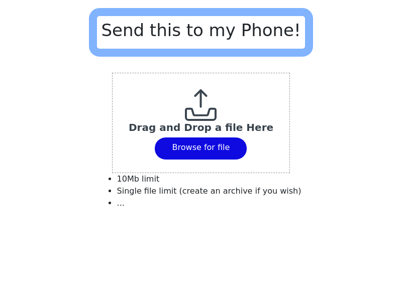

# SendThis

This project uses Google cloud functions in Go for the backend and Angular for the frontend. This project was to learn more about Google serverless services, cloud functions, cloud storage, etc.

It's an application to make it easy to send a file from your desktop or laptop without needing connect any wires. Browse or drag-and-drop a file less than 10Mb in size and it will be uploaded to the cloud, a secure download URL is generated and a QR code is displayed leading to the secure download URL. Scan the QR with your mobile device and download the file.

[https://send-this-42ae.web.app/](https://send-this-42ae.web.app/)

